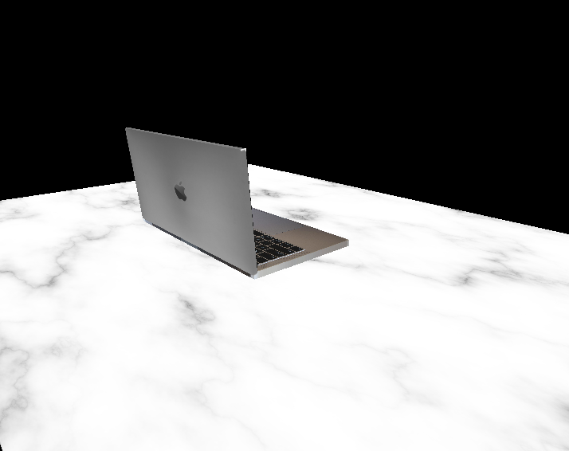

# 3D-Model-Rendering-in-C-Using-OpenGL



## Intro

The code within this repository serves as a demo of how to render objects in C++ using the OpenGL library. From a high level persepctive, primitive shapes are rendered and passed into shader programs as well as associated textures from image files. 

## Running the code

1. To run the code, you must first download the opengl source files:

```
git clone https://github.com/gmurin08/OpenGL_Source-
```

2. Follow the instructions within the repo for liking the proper include and library directories.

3. Compile and run

## Use Cases

With some modification, and an understanding of the underlying principles, this code can be used to create custom classes for rendering any object the user desires. All the necessary tools are located within the included project libraries. 

## Resources

If you're interested in rendering your own 3D models, [Learn OpenGL](https://learnopengl.com/Introduction) is a great resource to learn more about the underlying principles surrounding this projects implementation. 

